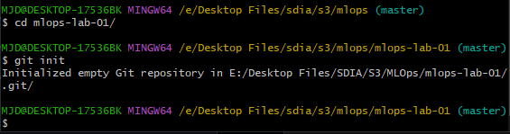

# Compte Rendu - Lab 2 - MLOps

Soufiane MAJDALANE

# **Code Source management**

### **Étape 1 : Initialiser Git dans mlops-lab-01 dans Git bash**

Creation du fichier `.gitignore`

Vérification de l’état du dépôt :

### **Étape 2 : Premier commit du projet MLOps**

Ajout des dossiers et fichiers principaux

Création du premier commit :

Afficher l’historique :

### **Étape 3 : Observer une modification avec git diff**

**Modification un script existant dans `src/monitor_drift.py`**
`z_threshold (2.5 -> 2.0)`

Affichage les différences par rapport au dernier commit :

Ajout du fichier modifié à l’index et afficher les différences en staging:

Création d’un commit :

### **Étape 4 : Créer une branche de fonctionnalité liée au lab**

Création d’une branche :

Modification de `src/api.py` :

- ajout d’une gestion de `request_id` automatique

Ajout et commiting :

Lister les branches :

Revenir sur la branche principale :

### **Étape 5 : Fusionner la branche feature dans la branche principale**

Fusion des branches et verification d’historique

### **Étape 6 : Créer un conflit de merge sur src/train.py**

Création d’une nouvelle branche :

Modification du `src/train.py` 

- `gate_f1` à 0.50

Ajout et commiting:

Revenir sur la branche principale et modifier la même ligne dans `src/train.py`:

- `gate_f1` à 0.75

Ajout et commiting :

Fusion echouee:

On va résoudre le conflit dans `src/train.py` 

- choisir la valeur 0.70

Résoudre le conflit dans `src/train.py` → 0.70:

### **Étape 7 : Utiliser git stash dans le contexte du lab**

Modifier un fichier sans vouloir committer

- `ouvrir src/rollback.py et ajouter un commentaire TODO`

Affichage d’etat:

Mettre de côté les modifications et Lister les stash :

Récupérer les modifications :

### **Étape 8 : Tester git reset sur un fichier d’expérimentation**

Création un dossier d’expérimentation :

Créer un fichier de test :

Modification puis committing deux fois :

Effectuer un reset soft :

Effectuer un reset mixed :

Effectuer un reset hard :

### **Étape 9 : Annuler un commit avec git revert**

Ajouter un changement non souhaité dans `src/api.py` :

Liste des commits :

Revert du dernier commit :

Vérifier le contenu du fichier :

### **Étape 10 : Rebase d’une branche feature sur la branche principale**

Créer une branche :

Modifier `src/monitor_drift.py` 

- changer `last_n`→ exemple 500 :

Ajouter et committer :

Revenir sur la branche principale et créer un nouveau commit sur un autre fichier (par exemple `src/generate_data.py`) :

Revenir sur la branche feature :

Rebaser la branche feature sur la branche principale :

Vérifier l’historique :

